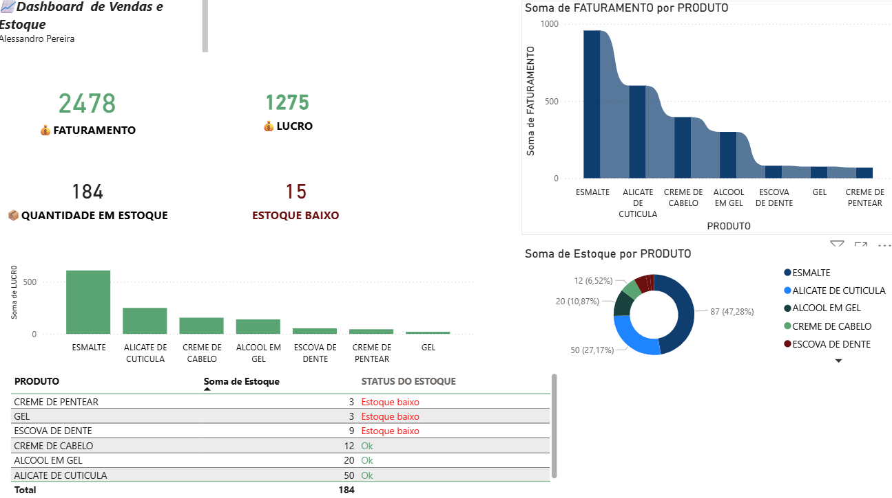

# 📊 Dashboard de Vendas e Estoque

Este projeto consiste no desenvolvimento de um dashboard interativo no Power BI com o objetivo de analisar o desempenho de vendas e o controle de estoque de uma empresa.

O dashboard permite uma visualização clara e estratégica dos principais indicadores, auxiliando na tomada de decisão.

## 🔍 O que o projeto mostra:

Análise de faturamento total
Cálculo de lucro
Identificação de produtos com estoque baixo
Acompanhamento de desempenho de vendas
Visualização clara e interativa dos dados

## 🛠️ Ferramentas utilizadas:

* Power BI
* Excel

## 📌 Objetivo:

Praticar e demonstrar habilidades em análise de dados, visualização e construção de dashboards interativos utilizando o Power BI.

## 🚀 Sobre mim:

Estou em transição para a área de dados e este é um dos meus primeiros projetos práticos.

